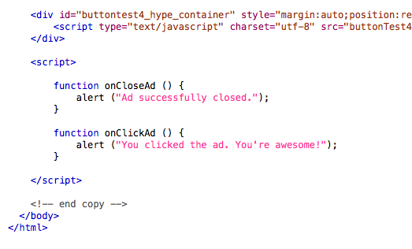
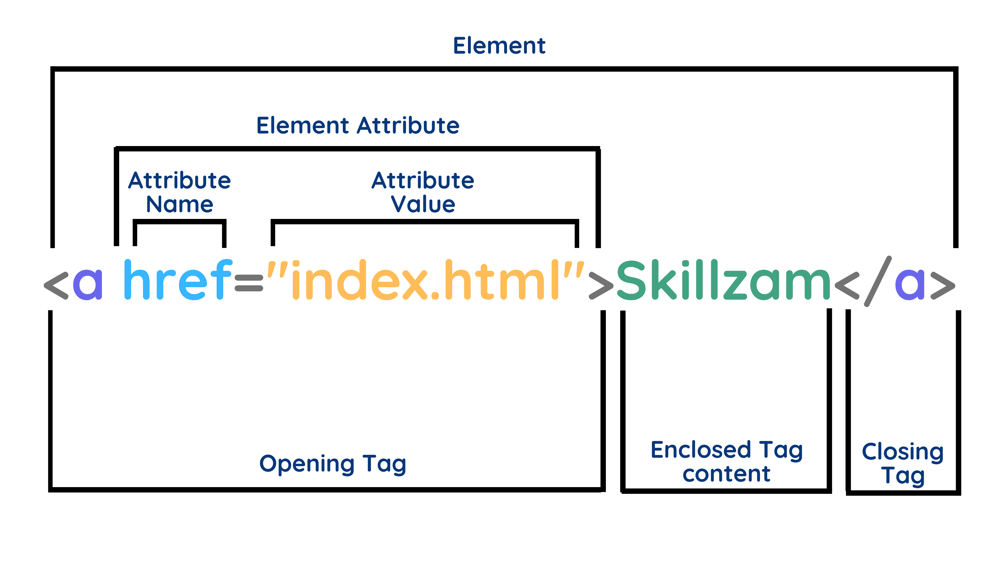
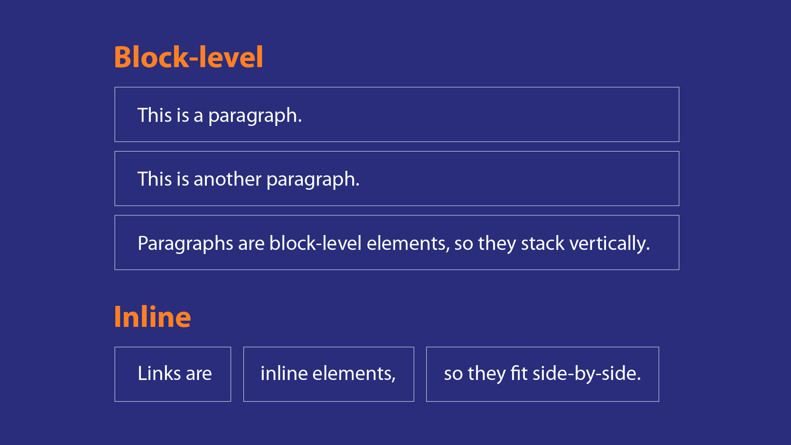
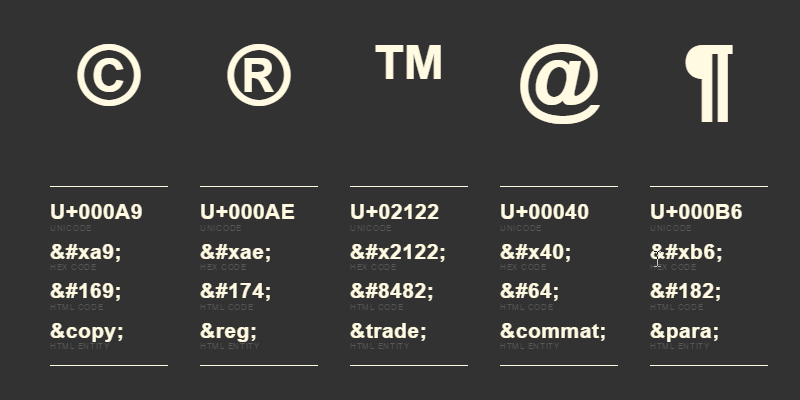

### What is HTML ?

- stands for `Hyper Text Markup Language`.
- describes the `structure of Web pages` using markup
- `building blocks` of web pages.
- `represented by tags`.
- `use them to render the content` on the web page (audio, text, images, etc.)

<br/>

### HTML Page Structure


<br/>

### `<head>` Tag

- container for `metadata` and `links` that define the document's properties.

#### Common Elements in `<head>`:

- `<title>`: Defines the title of the document, displayed on the browser tab.
- `<meta>`: Provides metadata such as character encoding, description, keywords, etc.
- `<link>`: Links to external resources like stylesheets.
- `<style>`: Contains internal CSS.
- `<script>`: Includes or links to JavaScript files.
- `<base>`: Specifies the base URL for relative links.

### `Meta Tags`

- provide `additional information` about the webpage.
- `not visible to users` but are `critical for SEO`, `accessibility`, and `browser behavior.`

### Commonly Used Meta Tags:

#### 1. `Charset Meta Tag`

Defines the `character encoding` for the document.

```html
<meta charset="UTF-8" />
```

- Ensures proper display of text.
- `UTF-8` supports most languages and symbols.

#### 2. `Viewport Meta Tag`

`Configures how a webpage is displayed on mobile devices`.

```html
<meta name="viewport" content="width=device-width, initial-scale=1.0" />
```

- `width=device-width`: Matches the screen width of the device.
- `initial-scale=1.0`: Sets the initial zoom level.

#### 3. `Description Meta Tag`

Provides a `brief description of the webpage content` (important for SEO).

```html
<meta name="description" content="A brief description of the page content." />
```

- Appears in search engine results.

#### 4. `Keywords Meta Tag`

Lists `keywords related to the webpage` (less relevant for modern SEO).

```html
<meta name="keywords" content="HTML, CSS, JavaScript" />
```

#### 5. `Author Meta Tag`

`Specifies the author` of the document.

```html
<meta name="author" content="John Doe" />
```

#### 6. `Robots Meta Tag`

`Controls how search engines index` the page.

```html
<meta name="robots" content="index, follow" />
```

- `index`: Allows indexing.
- `follow`: Allows following links on the page.
- To prevent indexing:
  ```html
  <meta name="robots" content="noindex, nofollow" />
  ```

### Link Tags

Used to link external resources like CSS, icons, and prefetching resources.

####

```html
<!-- Linking Stylesheets -->
<link rel="stylesheet" href="styles.css" />

<!-- Adding Favicons -->
<link rel="icon" href="favicon.ico" type="image/x-icon" />

<!-- Preloading Resources -->
<link rel="preload" href="image.jpg" as="image" />
```

### Script Tags

Used to include JavaScript.

```html
<script src="script.js"></script>
```

### Base Tag

Specifies the base URL for relative links.

```html
<base href="https://example.com/" />
```

## Comments

```html
<!-- Write your comments here -->
```

- `not displayed` by the browser.
- `can help to document` source code.

<br />

### How HTML elements should be displayed/styled by CSS?

- CSS can be added to HTML elements in `3 ways`：


- Recommanded to `keep css in separate files`.

<br/>

### Makes HTML pages more dynamic and interactive by JavaScript

- JS can be added to HTML elements in `3 ways`：



<br/>

## Elements

### HTML Elements

- usually consists of a `start tag` and `end tag`, with the `content` inserted in between.



<br />

#### Do Not Forget the End TagDo Not Forget the End Tag

- Some HTML elements `will display correctly, even if you forget the end tag`：

  ```html
  <html>
    <body>
      <p>This is a paragraph</p>
      <p>This is a paragraph</p>
    </body>
  </html>
  ```

> Never rely on this. It might produce unexpected results and/or errors if you forget the end tag.

<br />

### Empty HTML Elements

- `elements with no content, so no closing tag`
- Empty elements `can be closed in the opening tag` like this：`<br />`.

<br />

### Use Lowercase Tags

- `not case sensitive`：`<P>` means the same as `<p>`.
- `recommends lowercase.`

<br />

## Attributes

### HTML Attributes

- provide `additional information` about an element.
- `always specified in the start tag`.
- `name/value pairs` like：name="value".

<br />

`Use Lowercase Attributes`

- `not case sensitive`
- `recommends lowercase`

<br />

### Core/Global Attributes

- 4 core attributes are `id`,`class`,`title`,`style`,`data-*`

### The Id Attribute

- used to specify a `unique id` for an HTML element
- used by `CSS` and `JavaScript` to `select and access` specific elements
- `case sensitive`

```html
<p id="html">This para explains what is HTML</p>
```

### The class Attribute

- specifies `one or more` class names for an element
- used by `CSS` and `JavaScript` to `select and access` specific elements
- `case sensitive`
- `Different HTML elements` can point to the `same class name`

```html
<p class="sub-heading bold italic">This para explains what is HTML</p>
...
<p class="sub-heading">This para explains what is HTML</p>
...
<p class="sub-heading">This para explains what is HTML</p>
```

### The title Attribute

- displayed as a `tooltip` when cursor comes over.

```html
<h3 title="Hello HTML!">Titled Heading Tag Example</h3>
```

### The Style Attribute

- used to `add styles` to an element

```html
<tagname style="property:value;">...</tagname>

<body style="background-color:red;font-size:12px">
  ...
</body>
```

### data-\* Attribute

- used to `store custom data` private to the page or application.
- The stored data can then be used in the page's `CSS` or `JavaScript` to create a more engaging user experience.

- The `data-*` attributes consist of two parts：
  1. The attribute name should not contain any `uppercase letters`, and must be at `least one character` long after the prefix "data-".
  2. The attribute value `can be any string`.

```html
<div id="mydiv" data-myval="10"></div>
<p
  onclick="showDetails(this)"
  data-director-name="Christopher Nolan"
  data-released-year="2010"
>
  Inception
</p>
```

## Nesting elements

- `elements can contain other elements`

```html
<p>My cat is <strong>very</strong> grumpy.</p>
```

#### wrong way

```html
<p>My cat is <strong>very grumpy.</p></strong>
```

## Marking up text

### Headings `<h1> - <h6>`

- `defines` the most important `headings and subheadings`
- contains `6` heading levels, `<h1> - <h6>`

```html
<h1>My main title</h1>
<h2>My top level heading</h2>
<h3>My subheading</h3>
<h4>My sub-subheading</h4>
<h5>My sub-subheading</h5>
<h6>My sub-subheading</h6>
```

### _output :_

<h1>My main title</h1>
<h2>My top level heading</h2>
<h3>My subheading</h3>
<h4>My sub-subheading</h4>
<h5>My sub-subheading</h5>
<h6>My sub-subheading</h6>

`Note:`

- `search engines` use the headings to `index` the structure and content of your web pages
- `Don't use` headings `to make text BIG or bold`

## Paragraphs `<p>`

- `regular text content`
- `browser will automatically remove extra spaces in content`

```html
<p>This is a single paragraph</p>
```

- #### _output :_ <p>This is a single paragraph</p>

## HTML Horizontal Rules `<hr>`

- defines a `thematic break`
- `used to separate content`
- #### _output :_ <hr/>

## HTML Line Breaks `<br>`

- used for `line break` (a new line)
- without starting a new paragraph
- #### _output :_
  <br/>
  <br/>

## `<pre>`

- defines `preformatted text`
- displayed in a fixed-width font (usually Courier), and it `preserves both spaces and line breaks`

```html
<pre>
  My Bonnie lies over the ocean.

  My Bonnie lies over the sea.

  My Bonnie lies over the ocean.

  Oh, bring back my Bonnie to me.
</pre>
```

- #### _output :_

<pre style="color:yellow">
  My Bonnie lies over the ocean.

  My Bonnie lies over the sea.

  My Bonnie lies over the ocean.

  Oh, bring back my Bonnie to me.
</pre>

## HTML Formatting Elements

| Element    | Description      |
| ---------- | ---------------- |
| `<b>`      | Bold text        |
| `<strong>` | Important text   |
| `<i>`      | Italic text      |
| `<em>`     | Emphasized text  |
| `<mark>`   | Marked text      |
| `<small>`  | Smaller text     |
| `<del>`    | Deleted text     |
| `<s>`      | Strike text      |
| `<ins>`    | Inserted text    |
| `<u>`      | Underlined text  |
| `<sub>`    | Subscript text   |
| `<sup>`    | Superscript text |

## `<b>`

- defines `bold text`
- `without any extra importance`

```html
<b>This text is bold</b>
```

- #### _output :_
  <b>This text is bold</b>

## `<strong>`

- defines text with `strong importance`
- displayed in `bold text`

```html
<strong>This text is important!</strong>
```

- #### _output :_
  <strong>This text is important!</strong>

## `<i>`

- used to indicate a `technical term, a phrase from another language, a thought, a ship name`, etc

```html
<i>This text is italic</i>
```

- #### _output :_
  <i>This text is italic</i>

## `<em>`

- defines `emphasized text`
- `screen reader` will pronounce the words in `<em>` with an emphasis, using `verbal stress`

```html
<em>This text is emphasized</em>
```

- #### _output :_
  <em>This text is italic</em>

## `<small>`

- defines `smaller text`

```html
<small>This text is small</small>
```

- #### _output :_
  <small>This text is italic</small>

## `<mark>`

- defines `marked or highlighted` text

```html
<span>Do not forget to buy <mark>milk</mark> today.</span>
```

- #### _output :_
  <span>Do not forget to buy <mark>milk</mark> today.</span>

## `<del>`

- defines `text deleted` from a document
- usually renders in `strike a line` through deleted text

```html
<span>My favorite color is <del>blue</del> red.</span>
```

- #### _output :_
  <span>My favorite color is <del>blue</del> red.</span>

## `<s>`

- renders in `strike a line` through text

```html
<span>My favorite color is <s>blue</s> red.</span>
```

- #### _output :_
  <span>My favorite color is <s>blue</s> red.</span>

## `<ins>`

- defines a `text inserted` into a document
- usually renders in `underline` inserted text

```html
<span>My favorite color is <ins>red</ins>.</span>
```

- #### _output :_
  <span>My favorite color is <ins>red</ins>.</span>

## `<u>`

- renders `underlined` text

```html
<span>My favorite color is <u>red</u>.</span>
```

- #### _output :_
  <span>My favorite color is <u>red</u>.</span>

## `<sub>`

- defines `subscript text`
- subscript text appears `half a character below` the normal line
- used for `chemical formulas`,etc

```html
<span>H<sub>2</sub>0</span>
```

- #### _output :_
  <span>H<sub>2</sub>0</span>

## `<sup>`

- defines `superscript text`
- superscript text appears `half a character above` the normal line
- used for `footnotes`, `math square`,etc

```html
<span>WWW<sup>[1]</sup></span>
```

- #### _output :_
  <span>WWW<sup>[1]</sup></span>

## HTML Quotation and Citation Elements

## `<blockquote>`

- defines a section that is `quoted from another source`
- `cite attribute` defines the `source`
- browsers usually `indent` it

```html
<p>Here is a quote from WWF's website:</p>
<blockquote cite="http://www.worldwildlife.org/who/index.html">
  For 60 years, WWF has worked to help people and nature thrive. As the world's
  leading conservation organization, WWF works in nearly 100 countries.
</blockquote>
```

- #### _output :_
<p>Here is a quote from WWF's website:</p>
<blockquote cite="http://www.worldwildlife.org/who/index.html">
For 60 years, WWF has worked to help people and nature thrive. As the world's leading conservation organization, WWF works in nearly 100 countries.
</blockquote>

## `<q>`

- defines a `short quotation`
- browsers normally insert `quotation marks` around the quotation

```html
<span>
  WWF's goal is to:
  <q>Build a future where people live in harmony with nature.</q>
</span>
```

- #### _output :_ <span>WWF's goal is to: <q>Build a future where people live in harmony with nature.</q></span>

## `<abbr>`

- defines an `abbreviation`, like `HTML`, `CSS`, `Mr.`, `Dr.`, `ASAP`, `ATM`,etc
- can give useful information to `browsers`, `translation systems` and `search-engines`

- `Tip`: use `title attribute` to show the description for the abbreviation/acronym when you mouse over the element

```html
<span>
  The <abbr title="World Health Organization">WHO</abbr> was founded in 1948.
</span>
```

- #### _output :_
  <span>The <abbr title="World Health Organization">WHO</abbr> was founded in 1948.</span>

## `<address>`

- defines the `contact information`
- contact information can be an `email address`, `URL`, `physical address`, `phone number`, `social media handle`, etc
- usually renders in `italic`
- browsers will always `add a line break before and after` the it

```html
<address>
  Written by John Doe.<br />
  Visit us at:<br />
  Example.com<br />
  Box 564, Disneyland<br />
  USA
</address>
```

- #### _output :_
  <address>
  Written by John Doe.<br>
  Visit us at:<br>
  Example.com<br>
  Box 564, Disneyland<br>
  USA
  </address>

## `<cite>`

- defines the `title of a creative work` (e.g. `a book`, `a song`, `a movie`,etc.)
- usually renders in `italic`

`Note`: A person's name is not the title of a work.

```html
<span><cite>The Scream</cite> by Edvard Munch. Painted in 1893.</span>
```

- #### _output :_
  <span><cite>The Scream</cite> by Edvard Munch. Painted in 1893.</span>

## `<bdo>`

- BDO stands for `Bi-Directional Override`.
- used to `override the current text direction`

```html
<bdo dir="rtl">This text will be written from right to left</bdo>
```

- #### _output :_
  <bdo dir="rtl">This text will be written from right to left</bdo>

## HTML Links

- HTML links are `hyperlinks`
- can click on a link and `jump to another document`
- `cursor` will be `pointer`

- `Note:` A link does not have to be text. A `link can be an image or any other HTML element!`

```html
<a href="https://www.w3schools.com/">Visit W3Schools.com!</a>

<a href="default.asp">
  
</a>

<!-- How to link to an email address: -->
<a href="mailto:someone@example.com">Send email</a>

<!-- How to link to a phone number: -->
<a href="tel:+4733378901">+47 333 78 901</a>

<!-- How to link to another section on the same page: -->
<a href="#section2">Go to Section 2</a>
```

### target attribute

- specifies `where to open the linked document`
- can have one of the following values:

  - `_self` - Default. Opens the document in the `same window/tab`
  - `_blank` - Opens the document in a `new window or tab`
  - `_parent` - Opens the document in the `parent frame`
  - `_top` - Opens the document in the `full body of the window`

### By default, links will appear as follows in all browsers

- `unvisited link` => underlined and blue
- `visited link` => underlined and purple
- `active link` => underlined and red

- You can `change the link state colors`, by using CSS:

```html
<style>
  /* unvisited link will be green with no underline. */
  a:link {
    color: green;
    background-color: transparent;
    text-decoration: none;
  }
  /* visited link will be pink with no underline. */
  a:visited {
    color: pink;
    background-color: transparent;
    text-decoration: none;
  }
  /* hover link will become red and underlined */
  a:hover {
    color: red;
    background-color: transparent;
    text-decoration: underline;
  }
  /* active link will be yellow and underlined. */
  a:active {
    color: yellow;
    background-color: transparent;
    text-decoration: underline;
  }
</style>
```

### Create a Bookmark in HTML

- can `jump to specific parts` of a web page
- use the `id` attribute (id="value") to define bookmarks in a page
- use the `href` attribute (href="#value") to link to the bookmark

```html
<h2 id="C4">Chapter 4</h2>
. . .
<a href="#C4">Jump to Chapter 4</a>
```

- You can also add a link to a `bookmark` on another page:

```html
<a href="html_demo.html#C4">Jump to Chapter 4</a>s
```

## HTML Images ``

- used to `embed an image`
- `src` attribute, contains the `path of image file`
- `alt` specify `descriptive text`
  - `screen readers read out` the alt text
  - `on image loading error`, alt text displays

### Image Maps

- An image map is an `image with clickable areas`
- The areas are defined with one or more `<area>` tags.

```html


<map name="workmap">
  <area
    shape="rect"
    coords="290,172,333,250"
    alt="Phone"
    href="phone.htm"
    onclick="myFunction()"
  />
  <area shape="circle" coords="337,300,44" alt="Coffee" href="coffee.htm" />
  <area
    shape="poly"
    coords="140,121,181,116,204,160,204,222,191,270,140,329,85,355,58,352,37,322,40,259,103,161,128,147"
    href="croissant.htm"
  />
</map>
<script>
  function myFunction() {
    alert("You clicked the Phone!");
  }
</script>
```

### HTML `<picture>` Element

- allows to display `different pictures for different devices or screen sizes`.

```html
<picture>
  <source media="(min-width: 650px)" srcset="img_food.jpg" />
  <source media="(min-width: 465px)" srcset="img_car.jpg" />
  
</picture>
```

`Note:`

- Always specify an `` element as the `last child` element of the `<picture>` element for `fallback`.

### HTML Favicon

```html
<head>
  <title>My Page Title</title>
  <link rel="icon" type="image/x-icon" href="/images/favicon.ico" />
</head>
```

- `Tip`: A favicon is a small image, so it should be a simple image with high contrast.

## Lists `<ol>/<ul>/<dl>`

### Ordered lists `<ol>`

- An ordered list can be numerical or alphabetical
- `type attribute` defines the type of the list item marker
- `type="A"/"a"/"I"/"i"`
- By default, an ordered list will `start counting from 1`
- to start from a specified number, you can use the `start attribute`

```html
<ol type="1" start="5">
  <li>Coffee</li>
  <li>Tea</li>
  <li>Milk</li>
</ol>
```

### _output :_

<ol type="1" start="5">
  <li>Coffee</li>
  <li>Tea</li>
  <li>Milk</li>
</ol>

### Unordered lists `<ul>`

- List items will be `marked with bullets`
- `type attribute` defines the type of the list item marker
- `type="disc/circle/square/none"`

```html
<ul type="square">
  <li>technologists</li>
  <li>thinkers</li>
  <li>builders</li>
</ul>
```

### _output :_

<ul type="square">
  <li>technologists</li>
  <li>thinkers</li>
  <li>builders</li>
</ul>

### Description list `<dl>`

- list of terms`<dt>`, with a description`<dd>` of each term.

```html
<dl>
  <dt>Coffee</dt>
  <dd>- black hot drink</dd>
  <dt>Milk</dt>
  <dd>- white cold drink</dd>
</dl>
```

### _output :_

<dl>
  <dt>Coffee</dt>
  <dd>- black hot drink</dd>
  <dt>Milk</dt>
  <dd>- white cold drink</dd>
</dl>

## HTML Tables

- consists of table cells inside `rows and columns`

| Element      | Description                                                               |
| ------------ | ------------------------------------------------------------------------- |
| `<table>`    | Defines a table                                                           |
| `<th>`       | Defines a header cell in a table                                          |
| `<tr>`       | Defines a row in a table                                                  |
| `<td>`       | Defines a cell in a table                                                 |
| `<caption>`  | Defines a table caption                                                   |
| `<colgroup>` | Specifies a group of one or more columns in a table for formatting        |
| `<col>`      | Specifies column properties for each column within a `<colgroup>` element |
| `<thead>`    | Groups the header content in a table                                      |
| `<tbody>`    | Groups the body content in a table                                        |
| `<tfoot>`    | Groups the footer content in a table                                      |

- `colspan` : To make a `cell span over multiple columns`
- `rowspan` : To make a `cell span over multiple rows`

```html
<table style="width:100%;">
  <caption>
    Monthly savings
  </caption>
  <colgroup>
    <col span="2" style="background-color: blue" />
    <!-- to style columns in the middle of a table, insert a "empty" <col> element -->
    <!-- <col span="2"> -->
    <col span="1" style="background-color: green" />
    <!-- hide last column -->
    <!-- <col span="1" style="visibility: collapse"> -->
  </colgroup>
  <thead>
    <tr>
      <th colspan="2">Name</th>
      <th>Age</th>
    </tr>
  </thead>
  <tbody>
    <tr>
      <td>Jill</td>
      <td>Smith</td>
      <td>50</td>
    </tr>
    <tr>
      <td>Eve</td>
      <td>Jackson</td>
      <td rowspan="2">94</td>
    </tr>
    <tr>
      <td>Eve</td>
      <td>Jackson</td>
    </tr>
  </tbody>
</table>
```

<table style="width:100%;">
  <caption>Monthly savings</caption>
  <colgroup>
    <col span="2" style="background-color: blue">
    <!-- <col span="2"> -->
    <col span="1" style="background-color: green">
    <!-- <col span="1" style="visibility: collapse"> -->
  </colgroup>
  <thead>
   <tr>
    <th colspan="2">Name</th>
    <th>Age</th>
   </tr>
  </thead>
  <tbody>
  <tr>
    <td>Jill</td>
    <td>Smith</td>
    <td>50</td>
  </tr>
  <tr>
      <td>Eve</td>
    <td>Jackson</td>
    <td rowspan="2">94</td>
  </tr>
  <tr>
      <td>Eve</td>
    <td>Jackson</td>
  </tr>
  </tbody>
</table>

## HTML Forms

- used to `collect user input`

### `type="text"`

- defines a `single-line text input` field

### `type="email"`

- used for input fields that should contain an e-mail address

### `type="password"`

- defines a `password field`

### `type="hidden"`

- defines a `hidden input field` (not visible to a user)

- lets web developers `include data that cannot be seen or modified by users` when a form is submitted

### `type="number"`

- defines a `numeric input field`

### `type="submit"`

- defines a button for `submitting form data to a form-handler`
- `form-handler` is typically a `server page with a script for processing input data`
- `form-handler` is specified in the `form's action` attribute

### `type="reset"`

- will `reset all form values` to their default values

```html
<fieldset>
  <legend>Personalia:</legend>
  <form action="/action_page.php">
    <label for="fname">First name:</label><br />
    <input type="text" id="fname" name="fname" /><br />
    <label for="email">Email:</label><br />
    <input type="email" id="email" name="email" /><br />
    <label for="password">Password:</label><br />
    <input type="password" id="password" name="password" /><br />
    <label for="quantity">Quantity (between 1 and 5):</label><br />
    <input
      type="number"
      id="quantity"
      name="quantity"
      min="1"
      max="5"
    /><br /><br />
    <input type="hidden" id="custId" name="custId" value="3487" />
    <input type="submit" value="Submit" />
    <input type="reset" />
  </form>
</fieldset>
```

<fieldset>
<legend>Personalia:</legend>
<form action="/action_page.php">
  <label for="fname">First name:</label><br />
  <input type="text" id="fname" name="fname" /><br />
  <label for="email">Email:</label><br />
  <input type="email" id="email" name="email" /><br />
  <label for="password">Password:</label><br />
  <input type="password" id="password" name="password" /><br />
  <label for="level">Level (between 1 and 5):</label><br/>
  <input type="number" id="level" name="level" min="1" max="5"><br/><br/>
  <input type="hidden" id="custId" name="custId" value="3487" />
  <input type="submit" value="Submit" />
  <input type="reset" />
</form>
</fieldset>

- `<fieldset>` tag is used to group related elements in a form.
- `<fieldset>` tag draws a box around the related elements
- `<legend>` tag is used to define a caption for the `<fieldset>` element.

### `type="radio"`

- defines a `radio button`
- user will select `ONLY ONE` of a limited number of choices
- `name` for all radio input must be `same`

```html
<p>Choose your favorite Web language:</p>

<form>
  <input type="radio" id="html" name="fav_language" value="HTML" />
  <label for="html">HTML</label><br />
  <input type="radio" id="css" name="fav_language" value="CSS" />
  <label for="css">CSS</label><br />
  <input type="radio" id="javascript" name="fav_language" value="JavaScript" />
  <label for="javascript">JavaScript</label>
</form>
```

<p>Choose your favorite Web language:</p>

<form>
  <input type="radio" id="html" name="fav_language" value="HTML">
  <label for="html">HTML</label><br>
  <input type="radio" id="css" name="fav_language" value="CSS">
  <label for="css">CSS</label><br>
  <input type="radio" id="javascript" name="fav_language" value="JavaScript">
  <label for="javascript">JavaScript</label>
</form>

### `type="checkbox"`

- user select `ZERO or MORE options` of a limited number of choices

```html
<form>
  <input type="checkbox" id="vehicle1" name="vehicle1" value="Bike" />
  <label for="vehicle1"> I have a bike</label><br />
  <input type="checkbox" id="vehicle2" name="vehicle2" value="Car" />
  <label for="vehicle2"> I have a car</label><br />
  <input type="checkbox" id="vehicle3" name="vehicle3" value="Boat" />
  <label for="vehicle3"> I have a boat</label>
</form>
```

<form>
  <input type="checkbox" id="vehicle1" name="vehicle1" value="Bike">
  <label for="vehicle1"> I have a bike</label><br>
  <input type="checkbox" id="vehicle2" name="vehicle2" value="Car">
  <label for="vehicle2"> I have a car</label><br>
  <input type="checkbox" id="vehicle3" name="vehicle3" value="Boat">
  <label for="vehicle3"> I have a boat</label>
</form>

### `type="file"`

- defines a `file-select field` and a "Browse" button for `file uploads`.

```html
<form>
  <label for="myfile">Select a file:</label>
  <input type="file" id="myfile" name="myfile" />
</form>
```

<form>
  <label for="myfile">Select a file:</label>
  <input type="file" id="myfile" name="myfile">
</form>

### `type="range"`

- control for entering a number whose exact value is not important (like a `slider control`)

```html
<form>
  <label for="vol">Volume (between 0 and 50):</label>
  <input type="range" id="vol" name="vol" min="0" max="50" />
</form>
```

<form>
  <label for="vol">Volume (between 0 and 50):</label>
  <input type="range" id="vol" name="vol" min="0" max="50">
</form>

### `type="search"`

- used for `search fields`

```html
<form>
  <label for="gsearch">Search Google:</label>
  <input type="search" id="gsearch" name="gsearch" />
</form>
```

<form>
  <label for="gsearch">Search Google:</label>
  <input type="search" id="gsearch" name="gsearch">
</form>

### `type="tel"`

- used for input fields that should contain a `telephone number`

```html
<form>
  <label for="phone">Enter your phone number:</label>
  <input
    type="tel"
    id="phone"
    name="phone"
    pattern="[0-9]{3}-[0-9]{2}-[0-9]{3}"
  />
</form>
```

<form>
  <label for="phone">Enter your phone number:</label>
  <input type="tel" id="phone" name="phone" pattern="[0-9]{3}-[0-9]{2}-[0-9]{3}">
</form>

### `type="date"`

- used for input fields that should contain a `date`.

```html
<form>
  <label for="birthday">Birthday:</label>
  <input type="date" id="birthday" name="birthday" />
</form>
```

<form>
  <label for="birthday">Birthday:</label>
  <input type="date" id="birthday" name="birthday">
</form>

### `type="time"`

- used for input fields that should contain a `time`.

```html
<form>
  <label for="appt">Select a time:</label>
  <input type="time" id="appt" name="appt" />
</form>
```

<form>
  <label for="appt">Select a time:</label>
  <input type="time" id="appt" name="appt">
</form>

### `type="button"`

- defines a `button`

```html
<input type="button" onclick="alert('Hello World!')" value="Click Me!" />
```

<input type="button" onclick="alert('Hello World!')" value="Click Me!">

### `type="color"`

- used to `select color`

```html
<form>
  <label for="favcolor">Select your favorite color:</label>
  <input type="color" id="favcolor" name="favcolor" />
</form>
```

<form>
  <label for="favcolor">Select your favorite color:</label>
  <input type="color" id="favcolor" name="favcolor">
</form>

### `type="image"`

- defines an `image as a submit button`

```html
<form>
  <input
    type="image"
    src="greenArrow.png"
    alt="Submit"
    width="48"
    height="48"
  />
</form>
```

<form>
<input type="image" src="./images/greenArrow.png" alt="Submit" width="48" height="48">
</form>

### `type="url"`

- used for input fields that should contain a `URL address`

```html
<form>
  <label for="homepage">Add your homepage:</label>
  <input type="url" id="homepage" name="homepage" />
</form>
```

<form>
  <label for="homepage">Add your homepage:</label>
  <input type="url" id="homepage" name="homepage">
</form>

## HTML `<select>` Tag

- Create a `drop-down list`

- `<optgroup>` tag is used to `group related options` in a `<select>` element

- `<option>` tag defines an option in a select list.

```html
<label for="cars">Choose a car:</label>
<select name="cars" id="cars">
  <optgroup label="Swedish Cars">
    <option value="volvo">Volvo</option>
    <option value="saab">Saab</option>
  </optgroup>
  <optgroup label="German Cars">
    <option value="mercedes">Mercedes</option>
    <option value="audi">Audi</option>
  </optgroup>
</select>
```

<label for="cars">Choose a car:</label>
<select name="cars" id="cars">

 <option hidden value="">---Select---</option>
  <optgroup label="Swedish Cars">
    <option value="volvo">Volvo</option>
    <option value="saab">Saab</option>
  </optgroup>
  <optgroup label="German Cars">
    <option value="mercedes">Mercedes</option>
    <option value="audi">Audi</option>
  </optgroup>
</select>

## HTML Input Attributes

### `The value Attribute`

- specifies a `value for an input field`

### `The readonly Attribute`

- specifies that an input field is read-only( `cannot be modified` )

### `The disabled Attribute`

- specifies that an input field should be `disabled`
- it is `unusable` and `un-clickable`

```html
<form>
  <label for="fname">First name:</label><br />
  <input type="text" id="fname" name="fname" value="John" readonly /><br />
  <label for="lname">Last name:</label><br />
  <input type="text" id="lname" name="lname" value="Doe" disabled /><br />
</form>
```

<form>
  <label for="fname">First name:</label><br />
  <input type="text" id="fname" name="fname" value="John" readonly /><br/>
  <label for="lname">Last name:</label><br />
  <input type="text" id="lname" name="lname" value="Doe" disabled /><br/><br/>
</form>

### `The size Attribute`

- specifies the `visible width`, in characters, of an input field
- The default value for size is `20`.
- `Note`: works with : `text`, `search`, `tel`, `url`, `email`, and `password`.

### `The maxlength Attribute`

- specifies the `maximum number of characters allowed` in an input field

### `The min and max Attributes`

- specify the `minimum and maximum values` for an input field
- work with : `number`, `range`, `date`, `datetime-local`, `month`, `time` and `week`

### `The step Attribute`

- specifies the `legal number intervals` for an input field.
- eg: if step="3", legal numbers could be -3, 0, 3, 6, etc.

```html
<form>
  <label for="pin">PIN:</label><br />
  <input type="text" id="pin" name="pin" maxlength="6" size="15" />
  <label for="datemax">Enter a date before 1980-01-01:</label>
  <input type="date" id="datemax" name="datemax" max="1979-12-31" /><br /><br />

  <label for="datemin">Enter a date after 2000-01-01:</label>
  <input type="date" id="datemin" name="datemin" min="2000-01-02" /><br /><br />

  <label for="quantity">Quantity (between 0 and 10):</label>
  <input type="number" id="quantity" name="quantity" min="0" max="5" step="2" />
</form>
```

<form>
<label for="pin">PIN:</label><br />
<input type="text" id="pin" name="pin" maxlength="6" size="15" /><br />
<label for="datemax">Enter a date before 1980-01-01:</label><br />
<input type="date" id="datemax" name="datemax" max="1979-12-31" /><br />
<label for="datemin">Enter a date after 2000-01-01:</label><br />
<input type="date" id="datemin" name="datemin" min="2000-01-02" /><br />
<label for="quantity">Quantity (between 0 and 10):</label><br />
<input type="number" id="quantity" name="quantity" min="0" max="10" step="2" />

</form>

### `The autofocus Attribute`

- specifies that an input field should `automatically get focus` when the page loads

### `The autocomplete Attribute`

- specifies whether a form or an `input field should have autocomplete on or off`

### `The required Attribute`

- specifies that an input field `must be filled out before submitting` the form
- works with: `text`, `search`, `url`, `tel`, `email`, `password`, `date pickers`, `number`, `checkbox`, `radio`, and `file`

### `The placeholder Attribute`

- specifies a `short hint` that describes the expected value of an input field

```html
<form>
  <label for="fname">First name:</label><br />
  <input
    placeholder="name"
    type="text"
    id="fname"
    name="fname"
    autofocus
    autocomplete="off"
    required
  /><br />
</form>
```

<form>
  <label for="fname">First name:</label><br />
  <input
    type="text"
    id="fname"
    name="fname"
    autofocus
    autocomplete="off"
    required
  /><br />
</form>

### `The multiple Attribute`

- specifies that the user is `allowed to enter more than one value` in an input field
- works with : `email`, and `file`

```html
<form>
  <label for="files">Select files:</label>
  <input type="file" id="files" name="files" multiple />
</form>
```

<form>
  <label for="files">Select files:</label>
  <input type="file" id="files" name="files" multiple>
</form>

### `The pattern Attribute`

- specifies a regular expression that the input field's value is checked against, when the form is submitted.
- works with : `text`, `date`, `search`, `url`, `tel`, `email`, and `password`.

```html
<form>
  <label for="country_code">Country code:</label>
  <input
    type="text"
    id="country_code"
    name="country_code"
    pattern="[A-Za-z]{3}"
    title="Three letter country code"
  />
</form>
```

## HTML form Attributes

### `action Attribute`

- formaction attribute specifies the `URL of the file that will process the input` when the form is submitted

### `method Attribute`

- defines the `HTTP method` for sending form-data to the action URL
- eg `method="get/post"`

### `enctype Attribute`

- specifies how the `form-data should be encoded` when submitted (only for forms with `method="post"`).
- works with :
  - `application/x-www-form-urlencoded` : Default. All characters will be encoded before sent.
  - `multipart/form-data` : This value is necessary if the user will upload a file through the form.
  - `text/plain` : Sends data without any encoding at all. Not recommended.

```html
<form
  action="/action_page_binary.asp"
  method="post"
  enctype="multipart/form-data"
>
  <label for="fname">First name:</label>
  <input type="text" id="fname" name="fname" /><br /><br />
  <label for="lname">Last name:</label>
  <input type="text" id="lname" name="lname" /><br /><br />
  <input type="submit" value="Submit" />
</form>
```

## HTML Iframe

- used to `embed another document` within the `current HTML document`

```html
<iframe src="url" title="description"></iframe>
```

- `title` attribute used by `screen readers` to read out what the content of the iframe is

## HTML Computer Code Elements

### `<kbd>`

- used to define `keyboard input`

```html
<p>Save the document by pressing <kbd>Ctrl + S</kbd></p>
```

### _output :_

<p>Save the document by pressing <kbd>Ctrl + S</kbd></p>

### `<samp>`

- used to define `sample output from a computer program`

```html
<p>Message from my computer:</p>
<p>
  <samp>File not found.<br />Press F1 to continue</samp>
</p>
```

### _output :_

<p>Message from my computer:</p>
<p><samp>File not found.<br>Press F1 to continue</samp></p>

### `<code>`

- used to define a piece of `computer code`

```html
<code> x = 5; y = 6; z = x + y; </code>
```

### _output :_

<code>
x = 5;
y = 6;
z = x + y;
</code>

### `Notice`:

- `does not preserve extra whitespace and line-breaks`
- `to fix`,
<pre>
<code>
x = 5;
y = 6;
z = x + y;
</code>
</pre>

### `<var>`

- used to define a `variable in programming` or in a `mathematical expression`
- displayed in `italic`

```html
<p>
  The area of a triangle is: 1/2 x <var>b</var> x <var>h</var>, where
  <var>b</var> is the base, and <var>h</var> is the vertical height.
</p>
```

### _output :_

<p>The area of a triangle is: 1/2 x <var>b</var> x <var>h</var>, where <var>b</var> is the base, and <var>h</var> is the vertical height.</p>

## HTML `<details>` and `<summary>` Elements

- specifies `additional details` that the user `can open and close on demand`

```html
<details>
  <summary>Epcot Center</summary>
  <p>
    Epcot is a theme park at Walt Disney World Resort featuring exciting
    attractions.
  </p>
</details>
```

### _output:_

<details>
  <summary>Epcot Center</summary>
  <p>Epcot is a theme park at Walt Disney World Resort featuring exciting attractions.</p>
</details>

## HTML `<figure>` and `<figcaption>` Elements

```html
<figure>
  
  <figcaption>Fig1. - Trulli, Puglia, Italy.</figcaption>
</figure>
```

## HTML `<time>` Elements

```html
<p>I have a date on <time datetime="2008-02-14 20:00">Valentines day</time>.</p>
```

### _output:_

<p>I have a date on <time datetime="2008-02-14 20:00">Valentines day</time>.</p>

## HTML Multimedia

- Only `MP3`, `WAV`, and `Ogg` audio are supported by the HTML standard
- Only `MP4`, `WebM`, and `Ogg` video are supported by the HTML standard.
- The `<source>` element allows you to `specify alternative video files` which the browser may choose from
- The browser will use the `first recognized format`

```html
<audio controls autoplay muted>
  <source src="horse.ogg" type="audio/ogg" />
  <source src="horse.mp3" type="audio/mpeg" />
  Your browser does not support the audio element.
</audio>

<video width="320" height="240" autoplay muted>
  <source src="movie.mp4" type="video/mp4" />
  <source src="movie.ogg" type="video/ogg" />
  Your browser does not support the video tag.
</video>
```

- [audio and video methods reference](https://www.w3schools.com/tags/ref_av_dom.asp)

## HTML YouTube Videos

- YouTube will display an `id` (like tgbNymZ7vqY)

```html
<iframe
  width="420"
  height="315"
  src="https://www.youtube.com/embed/tgbNymZ7vqY"
>
</iframe>
```

- `mute=1` after `autoplay=1` to let your video start playing automatically (but muted)

- `controls=0` to not display controls in the video player

- `loop=1` to let your video loop forever

```html
<iframe
  width="420"
  height="315"
  src="https://www.youtube.com/embed/tgbNymZ7vqY?autoplay=1&mute=1&controls=0&loop=1"
>
</iframe>
```

<br />

## Block and Inline Elements

### Block-level Elements

- A block-level element `always starts on a new line`
- and `takes up the full width available` (stretches out to the left and right as far as it can).

- Some examples of block-level elements：

  - `<div>`
  - `<h1> - <h6>`
  - `<p>`
  - `<form>`

<br />

### Inline Elements

- `does not start on a new line`
- and `only takes up as much width as necessary`

- Some Examples of inline elements：

  - `<span>`
  - `<a>`
  - ``



<br />

## HTML Semantic Elements

- Semantic elements `describes the purpose of content inside element` to both the `browser` and the `developer`.

| Element        | Description                                                                                |
| -------------- | ------------------------------------------------------------------------------------------ |
| `<article>`    | Defines independent, self-contained content                                                |
| `<aside>`      | Defines content aside from the page content text                                           |
| `<details>`    | Defines additional details that the user can view or hide text                             |
| `<figure>`     | Specifies self-contained content, like illustrations, diagrams, photos, code listings, etc |
| `<figcaption>` | Defines a caption for a `<figure>` element text                                            |
| `<footer>`     | Defines a footer for a document or section                                                 |
| `<header>`     | Specifies a header for a document or section                                               |
| `<main>`       | Specifies the main content of a document                                                   |
| `<mark>`       | Defines marked/highlighted text                                                            |
| `<nav>`        | Defines navigation links                                                                   |
| `<section>`    | Defines a section in a document                                                            |
| `<summary>`    | Defines a visible heading for a `<details>` element                                        |
| `<time>`       | Defines a date/time                                                                        |

- `Non-semantic elements` `tells nothing about its content`
- eg. `<div>` and `<span>`

<br />

## HTML Entities

- `Reserved characters` in HTML must be `replaced with character entities`,as the browser `might mix them with tags`.
- To display a less than sign (`<`) we must write：`&lt;` or `&#60;`
- `Characters that are not present on your keyboard` can also be replaced by entities.

  ```
  &entity_name;

  OR

  &#entity_number;
  ```



> `Advantage of using an entity name`：An entity name is `easy to remember`.

> `Disadvantage of using an entity name`： `Browsers may not support all entity names`, but the support for `numbers is good`.

<br />

### Non-breaking Space

- Another common use of the `non-breaking space` is to prevent that `browsers truncate spaces` in HTML pages.

- If you write `10 spaces` in your text, the browser will `remove 9 of them`. To add real spaces to your text, you can use the `&nbsp;` character entity.

<br />

## Uniform Resource Locators

### HTML URL

- its `web address`.

- A URL can be `composed of words` (w3schools.com), or an Internet Protocol `(IP) address` (192.68.20.50).

- `Web browsers request pages from web servers` by using a URL.


<br />

### URL Encoding (encodeURIComponent())

- `converts non-ASCII characters into a format (ASCII character-set) that can be transmitted over the Internet`.
- replaces non-ASCII characters with a `%` followed by `hexadecimal digits`.
- URLs `cannot contain spaces`.it replaces a `space` with a plus `+` sign, or `%20`.
- Your browser will encode input, according to the character-set used in your page.
- The `default character-set` in HTML5 is `UTF-8`.

<br />

## Reference Information

HTML Tutorial (Website：[w3schools](http://www.w3schools.com/html/default.asp))

How Browsers Work: Behind the scenes of modern web browsers (Author：Tali Garsiel、Paul Irish)

Anatomy of an HTML element (Website：[Mozilla Developer Network](https://developer.mozilla.org/en-US/docs/Learn/Getting_started_with_the_web/HTML_basics#Anatomy_of_an_HTML_element))

Scripting (Website : [WHATWG HTML Living Standard](https://html.spec.whatwg.org/multipage/scripting.html#scripting-3))

Github repo (link : [Github Repo link](https://github.com/mujan5427/HTML-Notes))

<br />
